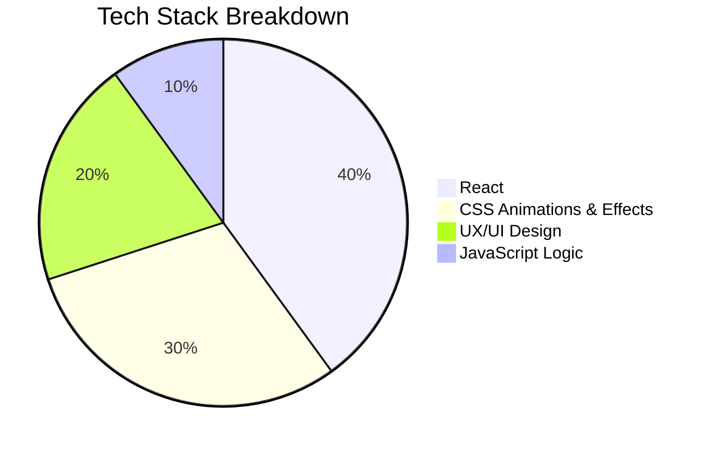

# 💸 SplitMate — Bill Splitting App

A sleek and animated bill-splitting React app to keep track of what you owe your friends — and what they owe you. Built with attention to **UX/UI**, **modern design principles**, **background effects**, and responsive stateful logic.

---

## 👥 Features

### 📋 Friends List

- Add friends with custom profile images.
- Select any friend to manage shared expenses.

### 💸 Split Bills Easily

- Enter bill amount and your share.
- Choose who paid the bill.
- Instantly updates the balance for both users.
- Prevents overpayment via smart validation.

---

## 📷 Demo Preview

> [Eat N Split](https://split-with-friends.netlify.app/)

---

## 📦 Tech Stack

- ⚛️ **React** (Hooks & Components)
- 🎨 **Custom CSS** (Animations, Gradients, Effects)
- 💡 **UX/UI Principles** (Visual feedback, transitions, layout)
- 📈 **State Management** (React useState & props drilling)

---

## 📊 Tech Stack Breakdown

